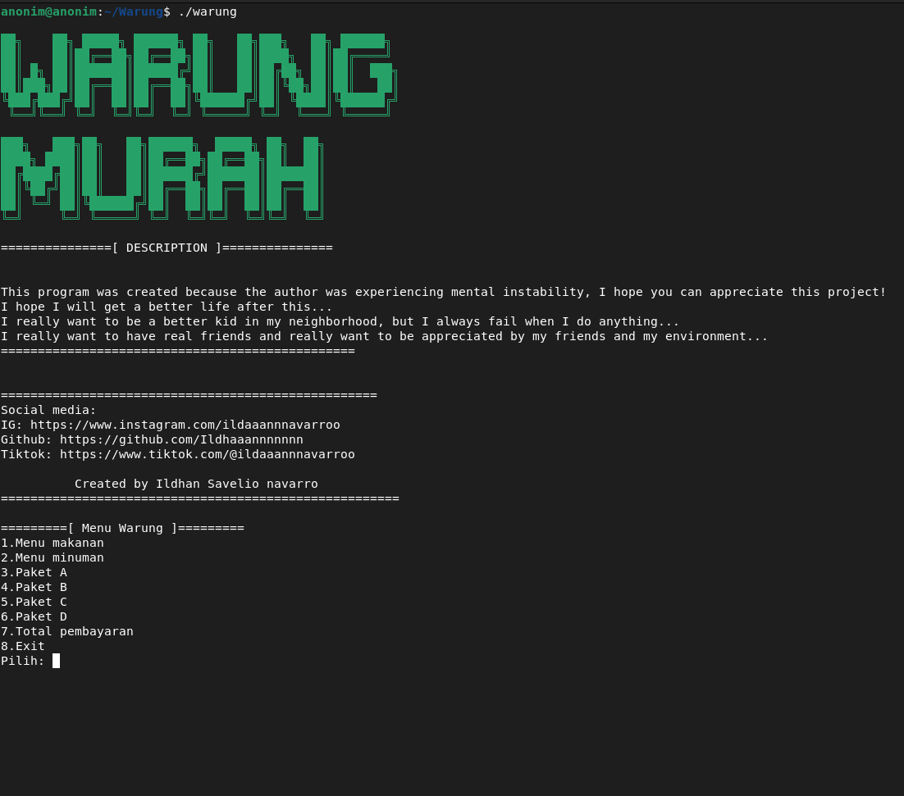

# Warung

A simple command-line warung (small shop) simulation written in C.

# Overview
Warung is a lightweight CLI application built using the C programming language.
It simulates a small local shop where users can view available items, make purchases, and see the total cost directly from the terminal.

This project was created mainly as a learning exercise to practice basic C programming concepts such as input/output, control flow, and simple program structure.

## Features
- Simple command-line interfaces
- Item list with prices
- Purchase simulation
- Automatic total price calculation

# Language Notice
The program output and user interaction are currently written entirely in Indonesian.

English language support is not available yet, but it is planned for a future update.

# Prerequisites
- Linux or Unix-base system
- GCC or Clang (C compiler)
- Basic familiarity with terminal usage

## To install GCC on Debian/Ubuntu
```Bash
 sudo apt install build-essential
```

# Installation
Clone the repository and build the program: 
```bash
git clone <https://github.com/Ildhaaannnnnnn/Warung-murah>
cd Warung
gcc -Wall warung.c -o warung
./warung
```

# Usage 
Run the program from the terminal: 
```bash
./warung
```
Follow the on screen instructions to select and complate a purchase

# Example


# Purpose
This project is intended fo:
- Beginners learning the C programming language
- Practicing basic logic, loops, and conditionals
- Understanding how simple CLI programs work

# Notes
- This is an educational project, not a production ready system.
- The code is intentionally kept simple for learning purposes.
- Future improvements may include: 
   + English language support
   + Better code structure using struct
   + File based data storage
   + Addtional features (stock, discounts, etc.)